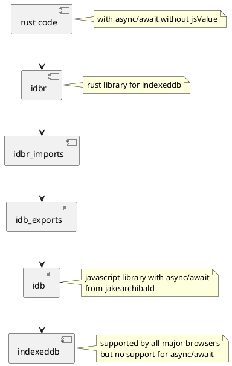

[comment]: # (lmake_md_to_doc_comments segment start A)

# indexeddb_from_rust

[comment]: # (lmake_cargo_toml_to_md start)

**experimenting with indexeddb in rust wasm PWA**  
***[repo](https://github.com/LucianoBestia/indexeddb_from_rust); version: 2021.223.1138  date: 2021-02-23 authors: Luciano Bestia***  

[comment]: # (lmake_cargo_toml_to_md end)

[comment]: # (lmake_lines_of_code start)
[](https://github.com/LucianoBestia/indexeddb_from_rust/)
[](https://github.com/LucianoBestia/indexeddb_from_rust/)
[](https://github.com/LucianoBestia/indexeddb_from_rust/)
[](https://github.com/LucianoBestia/indexeddb_from_rust/)
[](https://github.com/LucianoBestia/indexeddb_from_rust/)

[comment]: # (lmake_lines_of_code end)

[](https://github.com/LucianoBestia/indexeddb_from_rust/blob/master/LICENSE) [](https://github.com/LucianoBestia/indexeddb_from_rust/)

## experimenting

Indexeddb is the standard database storage inside the browser. It is not Sql. It is a document database.  
It is more or less a key-value storage, but the value can be a javascript object and that can be complex.  
The api is in javascript, uses old fashioned callbacks and events, completely async, without async/await or Promises.  
How to use it efficiently from rust? This is the question.  

## F12 developer tools

It is easy to see the content of indexeddb in F12. Very convenient.  

## plantuml diagrams

I will give a try to make diagrams for documentation with `plantuml`. Diagrams are defined using a simple and intuitive language.  
It follows the philosophy "everything as code". So it can be easily embedded in the code or documentation.  
The diagram can be created online on <http://www.plantuml.com/plantuml/umla/SoWkIImgAStDuNBAJrBGjLDmpCbCJbMmKiX8pSd9vt98pKi1IW80>  
Then it can be exported as svg and included as an image.  
<details>
  <summary>plantuml example</summary>



Now I can install Typescript:  

```bash
npm install -g typescript
tsc --version
tsc --help
```

In the terminal I just use `tsc` to transpile my source code with settings from `tsconfig.json`.  
I added this to my `cargo make` for easy developing.  
The typescript file is inside the `src` folder like rust source code files.  
The resulting javascript file is stored in the `js` folder of the web app folder.  

## typescript/javascript imports

I had major problems with `import` statements.  
I tried first with `npm install --save idb`. It saves the files in a separate `node_modules` folder. That didn't work nice with my `import` statements. I don't know why.  
At last I decided to create `idb` as a separate folder and copy the `node_modules/idb/build/esm`.  
I needed to play with `tsconfig.json` to make it work.  
I added the keys: baseUrl, rootDir, outDir, esModuleInterop and most important path.  
From one side this import paths are just like folder structure, from the other side they are like url paths.  
Confusing. But after a long experimentation I made it work. I hope I don't need ever to change this settings.  

## code flow

The browser opens `index.html`.  
There it runs `import init from "./pkg/indexeddb_from_rust.js";`  
and `init("./pkg/indexeddb_from_rust_bg.wasm");`  
This is the wasm code compiled from `lib.rs` and wasm-bindgen creates the magic to start the designated function.  
The `idb_exports.js` is the result of typescript transpilation of `idb_exports.ts`, my only typescript module.
Inside that module I need to import the `idb` module with:  
`import * as idb from '/indexeddb_from_rust/idb/index.js';`
Then Rust code `idbr_imports_mod.rs` imports the `idb_exports.js` javascript module and functions.  
From here on we are now in pure (more or less) rust code.  

## missing unsafe

When importing javascript functions with `#[wasm_bindgen]` and `extern "C"`, the rust-analyzer shows a warning about `missing unsafe`. This is not correct, the rustc compiler compile it just fine. It is because the attribute macro wasm_bindgen uses magic and makes it safe. But rust-analyzer (for now) cannot understand attribute macros.  
For those looking to disable the missing-unsafe rule until it's fixed and are using VS Code, adding the following to your settings.json and reloading your editor will suppress these errors:

```config
"rust-analyzer.diagnostics.disabled": [
    "missing-unsafe"
]
```

## extern "C" - importing javascript functions

Javascript functions are imported using the `extern "C"` block.  
For now `rustfmt` has a bug that removes the word async, because here we have javascript functions and not C functions.  
The workaround is to add `rustfmt::skip`:  

```rust
#[rustfmt::skip]
#[wasm_bindgen(raw_module = "/indexeddb_from_rust/js/idb_exports.js")]
extern "C" {
    fn check_browser_capability();
    #[wasm_bindgen(catch)]
    fn init_db() -> Result<(), JsValue>;
    #[wasm_bindgen(catch)]
    fn add_key_value(store: String, key: String, value: String) -> Result<(), JsValue>;
}
```

For a javascript function with no return value is simple:  
`pub(crate) fn check_browser_capability();`  
A javascript async function can return one JSValue.  
`pub(crate) async fn get_key_value(key: String, ) -> JsValue;`  
If we want to catch errors in the Promise, add attribute `wasm_bindgen(catch)`, then the functions returns `Result<JsValue, JsValue>`:  

```rust
#[wasm_bindgen(catch)]
pub(crate) async fn init_db() -> Result<JsValue, JsValue>;
```

The imported async fn needs to be await just like rust functions. The macro wasm_bindgen makes some magic to transform Promises to futures on import:  
`let currdb = open_db().await.unwrap();`  
Some of the functions are async and others are not. It can lead to strange problems if an async function is used as a normal function. This is a thing to be careful about. Rust will hopefully show a warning, but javascript will not.  

## Currency exchange rates

I will get the daily exchange rate in json format from:  
<http://www.floatrates.com/daily/eur.json>  
and fill it into indexeddb.  

## pages

This PWA will have more pages. Pages are complete static html files inside tha pages folder. They use the same css as index.html.  
It is easy to edit and preview pages because they are complete.  
The rust code will fetch the html, extract only the body content and set_inner_html to div_for_wasm_html_injecting.  
A page is a template, and some placeholders will be replaced with data.  

## serde-wasm-bindgen

The indexeddb is key-value. Key is a string and value is any javascript object.  
That is really practical for javascript, but not so for rust.  
I will use [serde-wasm-bindgen](https://github.com/cloudflare/serde-wasm-bindgen) to work directly with javascript values from rust, because indexeddb stores javascript objects.  
From Rust to javascript:  
`serde_wasm_bindgen::to_value(&some_supported_rust_value)`  
From javascript to rust:  
`let value: SomeSupportedRustType = serde_wasm_bindgen::from_value(value)?;`  

## idbr rust functions

### init_upgrade_db

First of all the db must be initialized and upgraded.  
`idbr_mod::Database::init_upgrade_db("currdb", 2, &rust_closure_for_upgrade).await;`  
When the version is greater that the existing db version, it calls the rust closure.  
The closure looks like this:  

```rust
let rust_closure_for_upgrade = Closure::wrap(Box::new(
        move |db: JsValue, old_version: JsValue, new_version: JsValue, transaction: JsValue| {
            upgrade_currdb(db, old_version, new_version, transaction);
        },
    )
```  

We create a new store with: `db.create_object_store("Currency");`.  
To add/modify data in the store we must the given use the `Transaction` in mode `versionchange`.  
First we define the object store and then put the data:  
`let cfg = tx.get_object_store("Config");`  
`cfg.put("base_currency", "EUR");`  

### modify one data with implicit transaction

```rust
let db = idb::Database::use_db("currdb").await;
db.put_key_value("store", "key", "value").await.unwrap();
```

### modify many data in one transaction

```rust
let db = idb::Database::use_db("currdb").await;
let tx = db.transaction();
let store = tx.get_object_store_readwrite("Currency");
store.put("a", "a");
store.put("b", "b");
store.put("c", "c");
tx.close();
```

